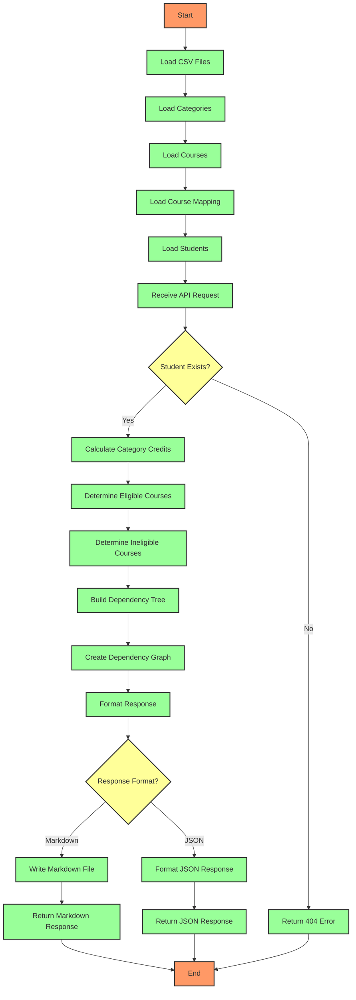

I apologize for the error. Here is the corrected Mermaid flowchart without the syntax issue:

### Explanation

1. **Start**: The application starts.
2. **Load CSV Files**: Various CSV files are loaded for categories, courses, course mappings, and students.
3. **Load Categories**: Categories are loaded from a CSV file.
4. **Load Courses**: Courses are loaded and prerequisites are parsed.
5. **Load Course Mapping**: Course mappings are loaded from a CSV file.
6. **Load Students**: Student data is loaded, including the courses they have taken.
7. **Receive API Request**: An API request is received for a specific student's progress.
8. **Student Exists?**: The application checks if the student exists.
    - If **Yes**:
        - **Calculate Category Credits**: Calculate the credits the student has earned in each category.
        - **Determine Eligible Courses**: Determine which courses the student is eligible to take.
        - **Determine Ineligible Courses**: Determine which courses the student is not eligible to take and why.
        - **Build Dependency Tree**: Build a dependency tree for the eligible courses.
        - **Create Dependency Graph**: Create a dependency graph in Mermaid format.
        - **Format Response**: Format the response based on the requested format.
        - **Response Format?**:
            - If **Markdown**:
                - **Write Markdown File**: Write the progress report to a Markdown file.
                - **Return Markdown Response**: Return the Markdown response.
            - If **JSON**:
                - **Format JSON Response**: Format the progress report as a JSON response.
                - **Return JSON Response**: Return the JSON response.
    - If **No**:
        - **Return 404 Error**: Return a 404 error indicating the student was not found.
9. **End**: The application process ends.