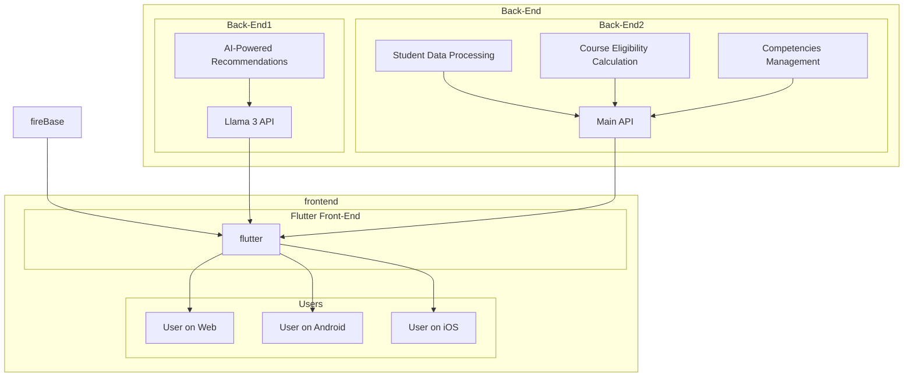

### 1. **Introduction**
   - **1.1 App Overview**
     The app is a comprehensive student management system that processes and analyzes student data. It offers functionalities such as course eligibility calculation, academic history tracking, competencies management, and integration with an advanced AI model (Llama 3). The app is built to provide cross-platform support for web, Android, and iOS through a Flutter front end, with two back-end systems managing different aspects of the application.
   
   - **1.2 Key Components**
     - **Two Back-End Systems:**
       1. **Main API:** Handles core operations such as student data processing, course eligibility, history tracking, and managing competencies.
       2. **Llama 3 API:** Dedicated to advanced AI-driven features, such as personalized recommendations and deeper data analysis.
     - **One Front-End (Flutter):** 
       - A cross-platform interface supporting **web**, **Android**, and **iOS**.
       - The front end integrates with both back-end systems and is divided into four key sections: Courses Overview, Student History, Competencies System, and Llama 3 Integration.

   - **1.3 Technologies Used**
     - **Back-End:** FastAPI, Python, CSV Parsing, Pydantic Models, Uvicorn.
     - **Front-End:** Flutter, supporting web, Android, and iOS.
     - **AI Integration:** Llama 3 for advanced AI-based features.
     - **Data Storage:** CSV files for storing student, course, and category data.
     - **Visualization:** Mermaid graphs for dependency trees of courses.

Here is the detailed **System Architecture** section along with a Mermaid graph:

---

### 2. **System Architecture**
   - **2.1 Overview**
     The system is composed of two back-end systems and one front-end interface. The architecture is designed to provide efficient data processing and advanced AI features while supporting multiple platforms for users.

     - **2.1.1 Two Back-End Systems**
       - **Main API:** 
         - Manages core operations such as handling student data, course management, tracking academic history, and managing competencies. 
         - Communicates directly with the front-end to return student-related information and process various course-related queries.
       - **Llama 3 API:** 
         - Dedicated to handling advanced AI features such as personalized recommendations and data-driven insights using the Llama 3 model.
         - Operates as a separate back end with its own API that is integrated into the front-end application.

     - **2.1.2 One Front-End (Flutter)**
       - **Cross-Platform Support:** The front end is built using Flutter, providing support for **web**, **Android**, and **iOS** platforms.
       - **Main Sections:**
         1. **Courses Overview:** Fetches and displays eligible and ineligible courses for students.
         2. **History:** Shows the student's academic history, including GPA, courses, and terms.
         3. **Competencies System:** Displays the competencies data fetched from the main back-end system.
         4. **Llama 3 Integration:** Interacts with the Llama 3 API for AI-driven features, such as personalized course recommendations.

#### Mermaid Graph Representation of the System Architecture

### 3. **Back-End 1: Main API**
The Main API is responsible for handling core student data operations, course management, eligibility calculations, and competencies tracking. It is built using FastAPI and communicates directly with the Flutter front end to deliver the necessary data and responses for the application's primary features.

   - **3.1 FastAPI Application**
     - The Main API is built using FastAPI, a modern, fast web framework for building APIs in Python.
     - It provides endpoints for fetching student information, processing course eligibility, and managing competencies.
     - FastAPI supports asynchronous request handling, improving performance when dealing with multiple requests.

   - **3.2 Middleware and CORS Setup**
     - **CORS (Cross-Origin Resource Sharing)** is configured to allow the front end (Flutter) to communicate with the back end without restrictions. This is important as the front end is deployed across multiple platforms (web, Android, iOS).
     - The CORS setup allows communication from any origin (open CORS policy), enabling the Flutter app to request and receive data from the API.
     - **Middleware**: Additional middleware is used for logging, error handling, and ensuring security best practices for API requests and responses.

   - **3.3 Data Flow and Interactions with the Front End**
     - The Main API interacts with the front end by handling the following requests:
       - **Student Data Requests**: Fetching and returning student information (e.g., academic history, current progress).
       - **Course Eligibility Calculations**: Based on the student's academic history, the API calculates which courses the student is eligible to take and returns this data to the front end.
       - **Competencies Management**: Tracks and manages student competencies, providing a comprehensive view of their skills and progress in various categories.
     - **Data Flow**:
       - The front-end Flutter app sends requests (via HTTP) to the API, querying for specific student data, course eligibility, or competencies.
       - The Main API processes the request, interacts with the CSV data sources, performs calculations, and returns JSON responses with the necessary data.
       - The front end then displays the data to the users (students) in a user-friendly format, such as a progress overview, eligible courses, and historical academic data.

#### 3.4 **Core Modules**

The Main API uses several core modules to handle student data, courses, and competencies. These modules define the structure of the data and handle CSV parsing and interaction with the database.

   - **3.4.1 Models**
     The Main API relies on several Pydantic models for data validation and serialization:
     - **Category Model**: Defines course categories, including the required credits and hierarchical relationships (e.g., subcategories).
     - **Course Model**: Represents a course, including its code, name, prerequisites, available terms, and category.
     - **Student Model**: Stores data related to students, including the courses they've taken and their academic progress.
     - **DependencyTree Model**: Represents the course dependency tree, which is used to visualize the courses required before taking a particular course.
     - **HD Models (Student, Course, Term, Year)**: High-detail models for student data, including GPA calculation at the course, term, and year levels.

   - **3.4.2 CSV Parsers**
     The Main API uses several CSV parsers to load student, course, and category data from CSV files. These parsers handle the conversion of raw data into structured Pydantic models:
     - **load_categories(file_path: str)**: Loads course categories from a CSV file.
     - **load_courses(file_path: str, categories: List[Category])**: Loads courses, including prerequisites and availability, and maps them to the appropriate category.
     - **load_students(file_path: str, courses: List[Course], mapping: dict)**: Loads student data and maps the courses each student has taken, calculating their progress and GPA.
     - **parse_data_from_csv(file_path: str, valid_subtypes: List[str])**: Parses data for student courses, term history, and GPA details, ensuring that only valid data is processed (e.g., filtering based on subtypes).

---

#### 3.5 **API Endpoints**

The Main API exposes several endpoints that are consumed by the front-end Flutter app. These endpoints provide the necessary data for student history, course eligibility, and progress tracking.

   - **3.5.1 `GET /student/{student_id}/history`**
     - Retrieves the academic history of a student by their ID.
     - Returns information such as courses taken, GPA, and terms completed.

   - **3.5.2 `GET /student/{student_id}/progress`**
     - Provides a detailed progress report for a student, including eligible courses and a Mermaid graph of course dependencies.
     - This endpoint returns a Markdown report summarizing the student's progress and course eligibility.

   - **3.5.3 `GET /student/{student_id}/progress2`**
     - Similar to the `/progress` endpoint but provides additional details such as predicted grades and progress in various categories.
     - Returns a more detailed JSON response, including expected grades and course dependencies.

   - **3.5.4 `GET /student/{student_name}`**
     - Fetches detailed information about a student based on their name.
     - Optionally allows comparison with other students (benchmarks) by passing benchmark IDs in the request.
     - Returns a summary of the student's competencies and progress compared to the benchmarked students.

#### 3.6 **Student Data Processing**
Student data processing is a core functionality of the Main API, which includes calculating course eligibility, tracking academic progress, and calculating GPA based on the courses a student has taken.

   - **3.6.1 Calculating Category Credits**
     - **calculate_category_credits(student: Student, categories: List[Category])**: This function calculates how many credits a student has earned in each course category. It loops through the student’s completed courses, assigns credits to the respective categories, and returns the progress made in each category.

   - **3.6.2 Course Eligibility Calculation**
     - **get_eligible_courses(student: Student, courses: List[Course], categories: List[Category])**: This function checks which courses a student is eligible to take based on the prerequisites and the student's academic progress. It uses the prerequisite tree, category credit requirements, and course availability to determine whether a student can enroll in a course.

   - **3.6.3 GPA Calculation**
     - **GPA Calculation for Courses**: Each course taken by a student has a GPA score based on the final grade. The system uses a predefined grade-to-GPA mapping to calculate GPA per course.
     - **Aggregating GPA Across Terms and Years**: GPA is aggregated at the term and year level by weighting each course’s GPA based on the number of credits, ensuring accurate representation of a student's academic performance over time.
     - **Student Level Classification**: Based on total credits earned, a student is classified into different levels: Freshman, Sophomore, Junior, or Senior. The system dynamically calculates and assigns the student’s level based on their overall progress.

#### 3.7 **Dependency Graphs**
Dependency graphs are used to visualize the prerequisites and dependencies of courses, helping students understand which courses they need to take to become eligible for advanced courses.

   - **3.7.1 Building the Dependency Tree**
     - **build_dependency_tree(course: Course)**: This function constructs a tree of course dependencies. It starts with a target course and recursively builds a tree structure by adding all prerequisite courses as child nodes. The resulting tree represents the complete set of dependencies that a student must fulfill to take the target course.

   - **3.7.2 Creating a Mermaid Graph**
     - **create_dependency_graph(eligible_courses)**: This function uses the dependency tree to generate a visual representation using Mermaid syntax. The graph displays the eligible courses and their dependencies, making it easier for students to plan their academic path by understanding which courses they need to complete in sequence.

#### 3.8 **Predicted Grades**
The Main API includes functionality to predict grades for students based on random sampling or AI-powered predictions.

   - **3.8.1 Generating Predicted Grades**
     - **fetch_predicted_grades(student_id, courses)**: This function generates random predicted grades for courses using the student's ID as a seed. These grades are used as placeholders or for generating reports with expected performance. The grades are rounded to match the standard GPA scale.

#### 3.9 **Report Generation**
The system generates comprehensive progress reports for students, including detailed information on course eligibility, GPA, and predicted grades.

   - **3.9.1 Markdown Report**
     - **write_course_info_to_md_file(student_id, student_data, file_path, mermaid_graph)**: This function generates a Markdown file summarizing the student's academic progress, including earned credits, eligible and ineligible courses, and the dependency graph in Mermaid format. The report is dynamically created for each student and provides a comprehensive overview of their academic standing.

#### 3.10 **Error Handling**
To ensure the system remains robust and user-friendly, various error-handling mechanisms are in place.

   - **3.10.1 404 Student Not Found**
     - When a student ID or name is not found in the system, the API returns a **404 error** with a clear message, allowing the front end to handle the situation appropriately and display a user-friendly error message.

   - **3.10.2 Custom HTTP Error Responses**
     - In addition to standard errors, custom HTTP exceptions are raised for specific situations, such as when course data is incomplete or invalid, or when prerequisites are missing. These error messages provide clear feedback to both developers and users, ensuring that problems are easily traceable and fixable.

### 4. **Back-End 2: Llama 3 API**
   - 4.1 Overview of Llama 3 API
   - 4.2 Purpose: Advanced AI Features and Personalization
   - 4.3 Integration with Flutter Front End
   - 4.4 API Endpoints for Llama 3
   - 4.5 Future Expansion and AI-Driven Features

### 5. **Front End: Flutter Application**
   - 5.1 Overview
   - 5.2 Cross-Platform Support (Web, Android, iOS)

   #### 5.3 Four Main Sections
   - 5.3.1 Courses Overview
     - API: Fetches eligible and ineligible courses for each student.
     - Display: Shows which courses are allowed and why others are restricted.
   - 5.3.2 Student History
     - API: Fetches the full academic history of each student.
     - Display: Displays GPA, courses taken, and progress across terms and years.
   - 5.3.3 Competencies System
     - API: Fetches competencies data from the main back-end system.
     - Display: Visualizes student progress in competencies.
   - 5.3.4 Llama 3 Integration
     - API: Fetches results from the separate Llama 3 API for advanced AI-driven features.

### 6. **Data Sources**
   - 6.1 CSV Files for Categories, Courses, and Students
   - 6.2 Competencies Data Source

### 7. **Deployment and Environment Setup**
   - 7.1 Setting Up FastAPI with Uvicorn for Main API
   - 7.2 Deploying the Llama 3 API
   - 7.3 Flutter Front End Deployment for Web, Android, and iOS
   - 7.4 Configuring the API Endpoints

### 8. **Future Improvements**
   - 8.1 Optimizing Data Loading and API Response Times
   - 8.2 Enhancing Predicted Grade Accuracy with Machine Learning
   - 8.3 Expanding Llama 3 Capabilities
   - 8.4 Additional Features for Competencies System

